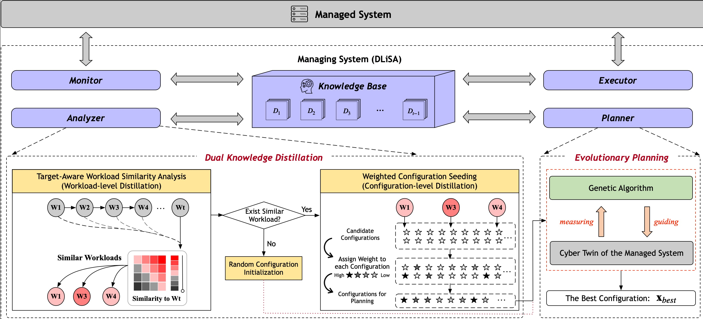

# DLiSA: Dynamic System Configuration via Lifelong Dually Distilled Self-Adaptation

> Given the time-varying workload, there is an increasing need for systems to continually and dynamically change their configurations such that the performance (e.g., latency and throughput) can be optimized---a typical process of self-adaptation. However, this poses significant unaddressed challenges related to how to exploit past knowledge in existing work, since neither explicit ignorance nor static exploitation of such knowledge in the planning of self-adaptation is ideal. In this paper, we propose a framework, dubbed DLiSA, aiming to dynamically self-adapt configurable systems. To better exploit the accumulated knowledge for rapid adaptation, DLiSA enables lifelong planning, whereby the planning process runs continuously throughout the lifetime of the system. More importantly, planning for a newly emerged workload is boosted via dually distilled knowledge seeding at two levels: the workload and configuration levels, considering the usefulness of the information to the new target workload. As such, the knowledge is dynamically purified such that only useful past configurations from the promising past workloads are seeded when necessary, mitigating misleading information. Experiments on 93 cases from nine real-world configurable systems confirm that the proposed DLiSA significantly outperforms state-of-the-art approaches, demonstrating a performance improvement of up to 209\% and a resource acceleration of up to 45$\times$ on generating promising adaptation configurations. In particular, the dual-level distillation in DLiSA significantly improves performance, raising the proportion of first-rank cases from 36.6\% to 67.7\% (an 85\% relative increase).




This repository contains the **key codes**, **full datasets used**,  and **raw experiment results** for the paper, providing a simple execution framework that can be easily embedded into different self-adaptation strategies.


# Documents

## dataset
The `dataset` folder contains configuration datasets for the following **9 subject systems**, each stored in a separate subfolder. The name of each subfolder corresponds to the system it represents. 

| System  | Language  | Domain            | Performance | #O   | #C   | #W  | Optimization Goal |
|---------|-----------|-------------------|-------------|------|------|-----|-------------------|
| JUMP3R  | Java      | Audio Encoder     | Runtime     | 16   | 4196 |  6  | Minimization      |
| KANZI   | Java      | File Compressor   | Runtime     | 24   | 4112 |  9  | Minimization      |
| DCONVERT| Java      | Image Scaling     | Runtime     | 18   | 6764 | 12  | Minimization      |
| H2      | Java      | Database          | Throughput  | 16   | 1954 |  8  | Maximization      |
| BATLIK  | Java      | SVG Rasterizer    | Runtime     | 10   | 1919 | 11  | Minimization      |
| XZ      | C/C++     | File Compressor   | Runtime     | 33   | 1999 | 13  | Minimization      |
| LRZIP   | C/C++     | File Compressor   | Runtime     | 11   | 190  |  13 | Minimization      |
| X264    | C/C++     | Video Encoder     | Runtime     | 25   | 3113 |  9  | Minimization      |
| Z3      | C/C++     | SMT Solver        | Runtime     | 12   | 1011 | 12  | Minimization      |

- **#O**: Number of options.
- **#C**: Number of configurations.
- **#W**: Number of workloads tested.
- **Optimization Goal**: Whether the goal is **minimization** (e.g., reducing runtime) or **maximization** (e.g., increasing throughput).

Each system folder contains **6 ~ 13 workloads**, depending on the system. The data is stored in `.csv` format, where each CSV file follows the below structure:

- **Columns (1 to n-1):** Configuration options, which can be either discrete or continuous values.
- **Column n:** Performance objective, represented as a numeric value (e.g., runtime, throughput).


## order_files
The `order_files` folder contains the execution order of workloads for each system over **100 independent runs**. 


## results
The `results` folder contains the **optimization results** for each system. Each system has its own subfolder where the corresponding optimization outcomes are stored.

#### Algorithm Comparison

- **D-SOGA, FEMOSAA, LiDOS, Seed-EA**: State-of-the-art (SOTA) baseline algorithms for comparison.
- **DLiSA**: The ICSE version of DLiSA.
- **DLiSA-Bx**: The improved version of **DLiSA** in this work, evaluated with different hyperparameter $\alpha$ settings.
- **DLiSA-I, DLiSA-II**: Two ablation study variants of the improved **DLiSA**.

#### Folder Structure and Example
Each algorithm folder contains results from **100 independent runs**, where the optimization process is stored in separate directories:

    results/
    │── run0/
    │   ├── DLiSA/
    │   │   ├── batik/
    │   │   │   ├── corona/
    │   │   │   |   ├── all_candidates.csv
    │   │   │   |   ├── all_results.csv
    │   │   │   |   ├── gen0.csv
    │   │   │   |   ├── gen1.csv
    │   │   │   |   ├── gen2.csv
    │   │   │   |   ├── gen3.csv  
    │   │   │   |   ├── purified_candidates.csv
 
    

- **`runx/{algorithm}/{system}/{workload}`**: Stores the **intermediate data** for each generation during the optimization process. This folder contains the data of all generations throughout the evolutionary process. 


## statistical tool
The `statistical_tool` folder contains scripts for conducting statistical analyses related to **all research questions (RQs)** and their corresponding results.

## supplementary file
The `supplementary_file` contains the specific workloads for 9 subjected systems and detailed experimental results for RQ1, RQ2, and RQ3.

## python files
- **main.py**:
  the *main program* for using DLiSA, which automatically reads data from csv files, implements *Knowledge Distillation* and *Evolutionary Planning*, and saves the corresponding results and data.

- **/tuner/{algorithm}.py** different adaptation algorithms.
- **utils/evolutionary_planning.py** the program for running *Evolutionary Planning*. The meaning of the key functions are as follows:
  - evaluate: evaluate the performance for the given configs
  - tournament_selection: select superior config from parent for generating offspring
  - single_point_crossover: single point crossover operator
  - mutate: mutation operator
  - fast_non_dominated_sort: fast non-domainted sort (for multiobjectivization environmental selection)
  - crowding_distance_assignment: calculate the crowding distance (for multiobjectivization environmental selection)

- **requirements.txt**
  the required packages for running main.py.

# Prerequisites and Installation
1. Download all the files into the same folder/clone the repository.

2. Install the specified version of Python:
   - The codes have been tested and is **recommended to run with Python 3.9**, Other versions might cause errors.
   - Using other versions may require adjusting dependency versions; otherwise, package compatibility issues may occur.

3. Using the command line: cd to the folder with the codes, and install all the required packages by running:

        pip install -r requirements.txt
        
4. Install R: R is required to run the experiments and **version 4.4 or later** is recommended. Please follow the installation instructions for your operating system at [R Project](https://cran.r-project.org/mirrors.html).

5. The  **devtools**  package is required for running the statistical analysis scripts (**RQ1 and RQ4**). Our scripts dynamically check for `devtools` package and install it automatically if it is missing. This ensures that users can run the scripts without additional setup. However, if the automatic installation fails due to system-specific configurations, users can manually install `devtools` in R by running:

        ```r
        install.packages("devtools")

6. For Ubuntu users, the following **Debian packages** should be installed before running the statistical analysis script (e.g., `rq1_scott-knott.py`):
        
        ```bash
        sudo apt-get update && sudo apt-get install -y \
        libfreetype6-dev libpng-dev libtiff5-dev libjpeg-dev \
        libharfbuzz-dev libfribidi-dev libfontconfig1-dev \
        libcurl4-openssl-dev

# Run *DLiSA*

- **Command line**: cd to the folder with the codes, input the command below, and the rest of the process will fully automated.

      python main.py
- **Python IDE (e.g., Pycharm)**: Open the *main.py* file on the IDE, and simply click 'Run'.

# Main Program Overview
The **main.py** script is structured with several key components:

- **Parameters Settings**: Configure essential parameters like the number of independent runs, maximum generations for GA, and population size.
- **Systems**: Define the list of systems to be optimized.
- **Compared Algorithms**: Specify which algorithms to compared for system performance tuning.
- **Optimization Goal**: Set the optimization objective for each (e.g., maximize throughput or minimize runtime).

# Example Setup for a Quick Demo
Modify these parameters in **main.py** to suit your optimization needs:

- **run**: Number of independent optimization runs (e.g., **run = 100**).
- **max_generation**: Maximum number of generations for the evolutionary process (e.g., **max_generation = 3**).
- **pop_size**: Population size for the Genetic Algorithm (e.g., **pop_size = 20**).
- **mutation_rate**: Probability of mutation in the evolutionary process (e.g., **mutation_rate = 0.1**).
- **crossover_rate**: Probability of crossover (e.g., **crossover_rate = 0.9**).
- **systems**: List of systems for optimization (e.g., **systems = ['batlik', 'kanzi']**).
- **compared_algorithm**: Algorithms for comparison (e.g.,**compared_algorithm = ['FEMOSAA', 'Seed-EA', 'D-SOGA', 'DLiSA', 'DLiSA-B4']** )

# Evaluation

After setting the necessary parameters and successfully running the project, statistical analysis scripts in the `statistical tool` folder can be used to compare the performance of all algorithms.

## RQ1: How effective is DLiSA ?

The script **`statistical tool/rq1_scott-knott.py`** performs **Scott-Knott** ranking analysis to evaluate the performance of different algorithms on the specified systems. The results are stored in the **`statistical_tool/RQ1/`** directory, with each system's ranking saved in a CSV file: `statistical tool/RQ1/{system_name}.csv`

### Stored Format

Each CSV file follows the structure shown below:

| Workload | Algorithm  | r | Mean (Std)    |
|----------|------------|---|---------------|
| corona   | FEMOSAA    | 3 | 0.954 (0.044) |
| corona   | Seed-EA    | 1 | 0.910 (0.019) |
| corona   | D-SOGA     | 3 | 0.912 (0.017) |
| corona   | LiDOS      | 3 | 0.915 (0.023) |
| corona   | DLiSA      | 3 | 0.911 (0.019) |
| corona   | DLiSA-B4   | 2 | 0.911 (0.022) |

- **Column `r`**: Represents the ranking of each algorithm, where **rank 1 indicates the best performance**.
- **Column `Mean (Std)`**: Displays the **mean performance value** across **100 independent runs**, along with the **standard deviation** in parentheses.

### Expected Outcome

The primary goal of our study is to **maximize the frequency at which DLiSA ranks 1**, demonstrating its superior performance compared to SOTA algorithms. In order to make a more intuitive comparison, **`rq1_scott-knott.py`** also prints the number of times each algorithm achieves **rank 1** directly in the console. This allows for an easy assessment of which algorithm performs best across different workloads and systems. 

By implementing this script, you can **quantitatively compare** optimization methods and validate the effectiveness of **DLiSA** against SOTA algorithms.

## RQ2: How efficient is DLiSA compared with others?

The script **`statistical tool/rq2_efficiency.py`** performs convergence analysis to evaluate the efficacy of different algorithms on the specified systems. Please refer to the paper for the detailed calculation process. The results are stored in the **`statistical_tool/RQ2/`** folder.

### Stored Format  

The results are stored in CSV files, comparing the efficiency (convergence speed) of **DLiSA** against baseline algorithms on different systems. For example, the file: `convergence_kanzi_DLiSA-B4_vs_DLiSA.csv` 
compares **DLiSA-B4** (DLiSA with parameter $\alpha$=0.3) and **DLiSA_ICSE** on the **Kanzi** system across different workloads.  

 
| workload       | target_b   | target_T   | my_m       | s           |
|----------------|------------|------------|------------|-------------|
| ambivert       | 80         | 1.8298     | 39         | 2.051282051 |
| artificl       | 80         | 0.1657     | 39         | 2.051282051 |
| deepfield      | 80         | 0.2926     | —          | -1          |
| enwik8         | 80         | 2.6246     | 38         | 2.105263158 |
| fannie_mae_500k| 80         | 1.8841     | 38         | 2.105263158 |
| large          | 80         | 0.6867     | 39         | 2.051282051 |
| misc           | 80         | 0.2426     | 39         | 2.051282051 |
| silesia        | 80         | 5.3858     | 38         | 2.105263158 |
| vmlinux        | 80         | 1.0921     | 39         | 2.051282051 |

#### **Column Explanation**
- **workload**: The tested workload in the Kanzi system.
- **target_b**: A baseline, b, is identified for the compared algorithm, representing the smallest number of measurements necessary for it to reach its best performance, i.e., **target_T**, averaging over 100 runs.
- **target_T**: The baseline algorithm’s best performance, averaging over 100 runs.
- **my_m**: The smallest number of measurements required by the DLiSA to get a result that is equivalent or better than **target_T**.
- **s**: The speedup of **DLiSA** over its counterpart, where `s=-1` indicates that convergence was not achieved.  
  - In the paper, we use `s = N/A` to represent cases where DLiSA cannot achieve the **target_T** reached by its counterpart.


## **Note on Reproducibility**  

Since the workload order is randomly shuffled across **100 independent runs**, and the optimization algorithms used are population-based methods, the **initial population** may vary in each execution. As a result, the reproduced results may exhibit slight statistical fluctuations compared to the reported data in the paper. However, these variations should not affect the overall conclusions of the study.

### **Execution Time Estimation**  
- Running `main.py` typically takes **around 3 hours** to complete.  
- The evaluation scripts for **RQ1 ~ RQ4** in the `statistical tool` folder generally take only **a few minutes** each.  
